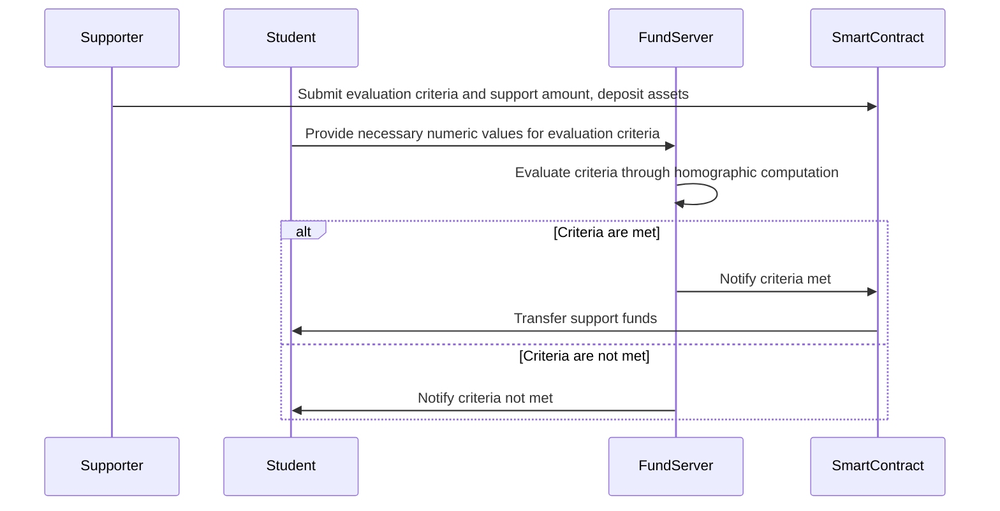

# 3. General system architecture

Students provide information about their financial situation and social credits, and the endorser evaluate them (this evaluation will be done privately) to decide whether the students are qualified for the financial support.

## 3.1 Overview

The process would flow as follows:

1. Supporters present their own evaluation criteria and the amount of support they offer, and deposit the corresponding assets into a smart contract.

2. Students (and other stakeholders) who want to apply for the scholarship provide the necessary numeric values to the evaluation criteria.

    Note: It is not necessarily the case that the students alone provide the information. For example, the school that the students attend may provide information about their academic performance, and non-profit organizations may provide information about their contributions in extracurricular volunteer activities.

3. The Fund server evaluates whether the criteria are met through homographic computation.

4. If the criteria are met, the deposited support funds in the smart contract are transferred to the student's address.

Assume that there is no need to repay this scholarship.

## 3.2 how to get off-chain data

to provide stuendt's bank balance(other financial information) to the system, we need to use a method that does not expose the student's privacy.
we can archive this by using TLSNotary.

1. Notarize your bank balance with TSLN
2. Calculate student scores based on bank balances
3. Disclose scores to students

## 3.3 How to withdraw funds from the smart contract keep secret?

Consider how to transfer money based on the results of a review by FHE.

Although it is easy to execute a smart contract based on off-chain information, the execution result from the FHE server is encrypted, and basically only the encrypted student can know the result.Therefore, the key pairs used for encryption and decryption are managed in a decentralized manner, and the encrypted results are decrypted by a third party other than the user, thereby enabling money transfer through smart contracts.

In this paper, the keys are distributed among validators; Lit Protocol, for example, could be used as a substitute.
See: https://eprint.iacr.org/2020/464.pdf
****

Here the result of the examination should be True/False.

The party with the decentralized private key can know if the result is T/F, but this is not a problem, because the money transfer transaction is public and the result will eventually become public.
This is not a problem, because the remittance transaction is public and the result will eventually become public.
