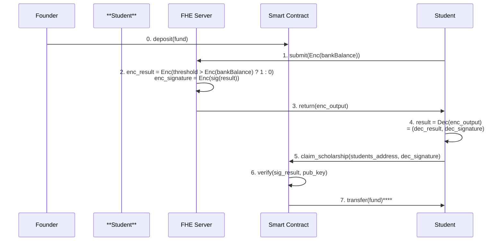

# 4. General system architecture

Students provide information about their financial situation and social credits, and the FHE server evaluate them (this evaluation will be done privately) to decide whether the students are qualified for the financial support.

## 4.1 Overview
For convenience, only bank balances will be evaluated here.

The process would flow as follows:

1. Founder deposits funds into the smart contract.
2. Student submits encrypted bank balance to the FHE server.
3. FHE server performs calculations on encrypted data, generating a result and signature.
4. FHE server returns the encrypted output to the Student.
5. Student decrypts the result.
6. Student claims the scholarship from the smart contract.
7. Smart contract verifies the signature.If verification is successful, the smart contract transfers funds to the Student.

## 4.2 How to get personal data with privacy?

To provide stuendt's bank balance(other financial information) to the system, we need to use a method that does not expose the student's privacy.
we can archive this by using TLS Notary.

This is based on basic TLSN usage.

However, there are still unresolved issues.
Basically, TLSN can only share plain text data (here bank balance) to a server (here FHE server). However, in the context of FHE, the data provider (here the student) needs to encrypt the data.If students were to encrypt the data themselves, it would be easy to counterfeit, and the use of TLSN would be meaningless.

## 4.3 How to withdraw funds from the smart contract keep secret?

Let's consider how to transfer fund based on the results of a review by FHE.
Although it is easy to execute a smart contract based on off-chain information, the execution result from the FHE server is encrypted, and basically only the encrypted student can know the result.
Therefore, it is considered difficult for the FHE server to directly execute the transfer transaction.

There are several solutions, but they are computationally expensive and some require changes to the Ethereum protocol.

- [Threshold FHE](https://eprint.iacr.org/2017/257.pdf)
- [Verifiable FHE](https://eprint.iacr.org/2024/032)
- [Evolving-Committee Proactive Secret Sharing](https://eprint.iacr.org/2020/464.pdf)

We decided to use digital signatures to execute the transfer transaction.
This solution does not require changes to the Ethereum protocol and the gas costs are within an acceptable range.
While the FHE server will perform relatively heavy computations, considering that it is off-chain and traditional scholarship reviews take 1-2 months, completing the process in a maximum of one day is acceptable.
